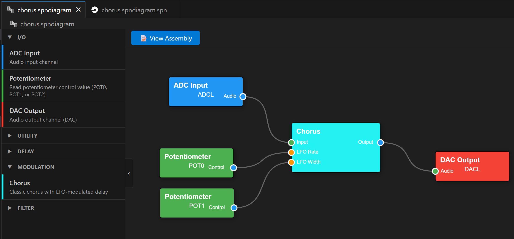
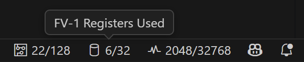
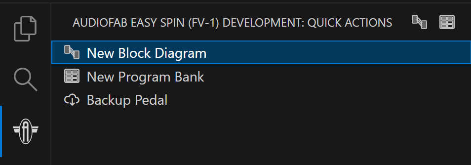

# Audiofab Easy Spin (FV-1) Programming Extension

A comprehensive Visual Studio Code extension for developing audio effects code for the [FV-1 DSP from Spin Semiconductor](http://www.spinsemi.com/products.html). This extension provides both traditional assembly programming and a modern visual block diagram editor for the [Audiofab Easy Spin](https://audiofab.com/products/easy-spin) guitar pedal.

## Features

### 📝 Assembly Language Support
Full support for traditional FV-1 assembly programming:
- **Syntax highlighting** for `.spn` files and the FV-1 instruction set
- **Real-time diagnostics** showing errors and warnings as you type
- **Hover information** with instruction documentation and register/memory details
- **Go to definition** (Ctrl+Click) for user-defined symbols
- **Built-in assembler**

### 🎨 Visual Block Diagram Editor
Create FV-1 programs visually by connecting blocks together - no assembly code required! The block diagram editor provides:
- **Drag-and-drop block palette** with categorized blocks
- **Real-time compilation** with live error checking and resource usage tracking
- **View generated assembly** to see the code produced from your diagram
- **Code optimizer** that tries to optimize the generated assembly to save program space
- **Instantly program the current diagram** into any one of the 8 slots on your [Audiofab Easy Spin](https://audiofab.com/products/easy-spin) pedal

### 📊 Resource Usage Tracking
Monitor your program's resource consumption in real-time in the taskbar:
- **Instructions**: Visual indicator showing usage out of 128 instructions
- **Registers**: Track usage of 32 available registers (currently for block diagrams only)
- **Delay Memory**: Monitor usage out of 32768 words

### 🏦 Program Bank Management
Organize and deploy multiple programs to your Easy Spin pedal:
- **Visual bank editor** for managing all 8 program slots
- **Drag-and-drop assignment** from File Explorer to bank slots or **create new files** right from the bank editor
- **Mix and match** `.spn` assembly and `.spndiagram` block diagram files
- **Program individual slots** or the entire bank at once
- **Automatic compilation/assembly** of all files when programming
- **Export to Intel HEX** if you want to use this tool with your own pedal/programmer

### ⚡ Quick Actions Sidebar
Convenient sidebar in the Activity Bar with quick access to:
- Create new block diagram
- Create new program bank
- Backup pedal (saves entire EEPROM to an Intel HEX file)

### 💾 Hardware Programming
Direct integration with the [Audiofab USB Programmer](https://audiofab.com/store/easy-spin-programmer):
- **Program to any slot** (1-8) on your Easy Spin pedal
- **Automatic verification** of written data
- **Backup entire pedal** to Intel HEX format
- **Load HEX files** to EEPROM
- **Export banks to HEX** for use with other tools or archival purposes

## Installation

1. Install [Visual Studio Code](https://code.visualstudio.com)
2. Open the Extensions view (`Ctrl+Shift+X`)
3. Search for "Audiofab FV-1"
4. Click Install

For hardware programming, you'll need the [Audiofab USB Programmer](https://audiofab.com/store/easy-spin-programmer) connected to your Easy Spin pedal.

## Getting Started

### Creating Your First Block Diagram

1. Open the Quick Actions sidebar (click the Audiofab icon in the Activity Bar)
2. Click "New Block Diagram"
3. Choose a location and filename
4. Drag blocks from the palette onto the canvas
5. Connect blocks by clicking output ports and dragging to input ports
6. Program directly to a program slot on your [Audiofab Easy Spin](https://audiofab.com/products/easy-spin) (_Ctrl+Shift+P > FV-1: Assemble current file and load to EEPROM_), or create a program bank and add it there

_NOTE: After programming ensure you rotate the **Program** select switch off of the current program and back to have the FV-1 reload the new program contents from EEPROM_

### Creating Your First Program Bank

1. Open the Quick Actions sidebar (click the Audiofab icon in the Activity Bar)
2. Click "New Program Bank"
3. Choose a location and filename
4. Drag `.spn` or `.spndiagram` files from the File Explorer onto bank slots (hold _Shift_ to drop into a slot)
5. Click "Program Bank" to load all programs to your pedal

_NOTE: After programming ensure you rotate the **Program** select switch off of the current program and back to have the FV-1 reload the new program contents from EEPROM_

## Commands

Access these commands via the Command Palette (`Ctrl+Shift+P`):

### Assembly File Commands (`.spn`)
- **FV-1: Assemble current file** - Compile and check for errors (not really required as this is always performed in the background anyway)
- **FV-1: Assemble current file and load to EEPROM** - Compile and program to pedal (`Ctrl+Shift+F5`)
- **FV-1: Assemble current file to an Intel HEX file** - Export to HEX format (`Ctrl+Alt+F5`)

### Block Diagram Commands (`.spndiagram`)
- **FV-1: Assemble current file and load to EEPROM** - Compile diagram, assemble generated assembly and program to pedal (`Ctrl+Shift+F5`)
- **FV-1: Assemble current file to an Intel HEX file** - Export compiled diagram to HEX

### Intel HEX Commands (`.hex`)
- **FV-1: Load HEX to EEPROM** - Program HEX file to pedal (`Ctrl+Shift+F6`)

### Utility Commands
- **FV-1: Backup pedal** - Save entire EEPROM (all 8 slots) to HEX file
- **FV-1: Create `.spnbank`** - Create a new bank of programs
- **FV-1: Create new block diagram** - Create a new visual program

## Block Diagram Editor

### Supported Blocks

The current list of supported blocks is small, but this is the first release! Now that the machinery is in place, we will be porting over as many blocks as possible from the most excellent [SpinCAD Designer](https://github.com/HolyCityAudio/SpinCAD-Designer).

### Editor Features

- **Parameters panel**: Click on a block to modify its parameters
- **Lasso selection**: Ctrl+click and drag on empty canvas to select multiple blocks
- **Multi-select**: Hold Ctrl and click blocks to add to selection
- **Delete**: Press Delete or Backspace to remove selected blocks/connections
- **Pan**: Click and drag empty canvas to move view
- **Zoom**: Mouse wheel to zoom in/out
- **Undo**: If you delete something by accident, press Ctrl+Z to bring it back
- **Connection validation**: Invalid connections are rejected with helpful error messages

## Settings

Configure the extension in VS Code Settings (`File > Preferences > Settings` or `Ctrl+,`), then select _Extensions > Audiofab FV-1_.

**General Settings**
- `fv1.autoShowOutputWindow` - Automatically show Output panel on assembly (default: true)
- `fv1.verbose` - Show detailed assembly output including machine code (default: false)

**Hardware Settings**
- `fv1.i2cAddress` - I2C address of EEPROM in hex (default: 80 / 0x50)
- `fv1.writePageSize` - EEPROM page write size in bytes (default: 32)
- `fv1.verifyWrites` - Verify EEPROM contents after writing (default: true)
- `fv1.mcp2221VendorId` - USB Vendor ID for MCP2221 (default: "04D8")
- `fv1.mcp2221ProductId` - USB Product ID for MCP2221 (default: "00DD")

**Compatibility Settings**
- `fv1.spinAsmMemBug` - Emulate SpinASM IDE memory allocation bug for compatibility (default: true)
- `fv1.clampReals` - Emulate SpinASM IDE behaviour and clamp out of range real values (default: true)

## Troubleshooting

**No MCP2221 device found**
- Ensure the Audiofab USB Programmer is connected
- Check that drivers are installed (should be automatic on most systems?)
- Try a different USB port or cable

**Error programming EEPROM**
- Ensure the Audiofab USB Programmer is connected to the pedal and the pedal is powered on
- If on battery power, ensure an jack is plugged into the input jack

**Assembly errors**
- Check the Output panel (`View > Output`, select "FV-1 Assembler")
- Hover over problematic lines for detailed error information
- For block diagrams, check connection validation messages

**Program doesn't sound right**
- Ensure you rotate the **Program** select switch off of the current program and back to have the FV-1 reload the new program contents from EEPROM
- Verify resource usage isn't exceeding limits (red indicators in status bar)
- There could be a bug in the assembler - file an issue!

## Contributing

Found a bug or have a feature request? Please use the [Issue Tracker](https://github.com/audiofab/fv1-vscode/issues).

If you find a program that fails to assemble or a block diagram that doesn't compile correctly, please include the file contents in your issue report.

## Resources

- [FV-1 Documentation](http://www.spinsemi.com/products.html)
- [Audiofab Easy Spin](https://audiofab.com/products/easy-spin)
- [SpinCAD Designer](https://github.com/HolyCityAudio/SpinCAD-Designer) - the "OG" and the inspiration for this extension!
- [FV-1 Programs](https://mstratman.github.io/fv1-programs) - a nice collection of FV-1 effects
- Special thanks to [@johntalton](https://github.com/johntalton) for his super-awesome mcp2221 and EEPROM libraries

## License

MIT License - See LICENSE file for details
