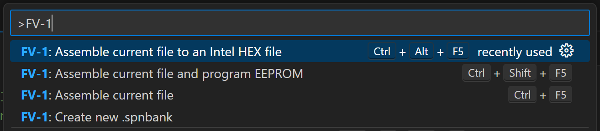
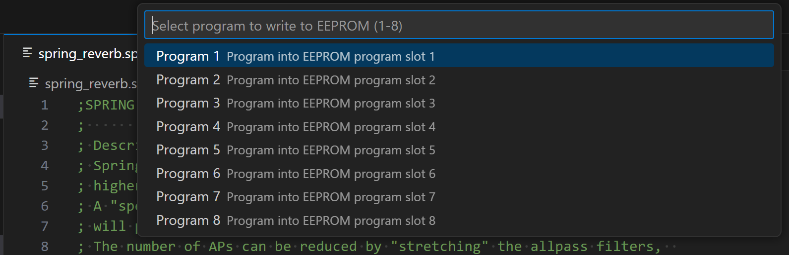
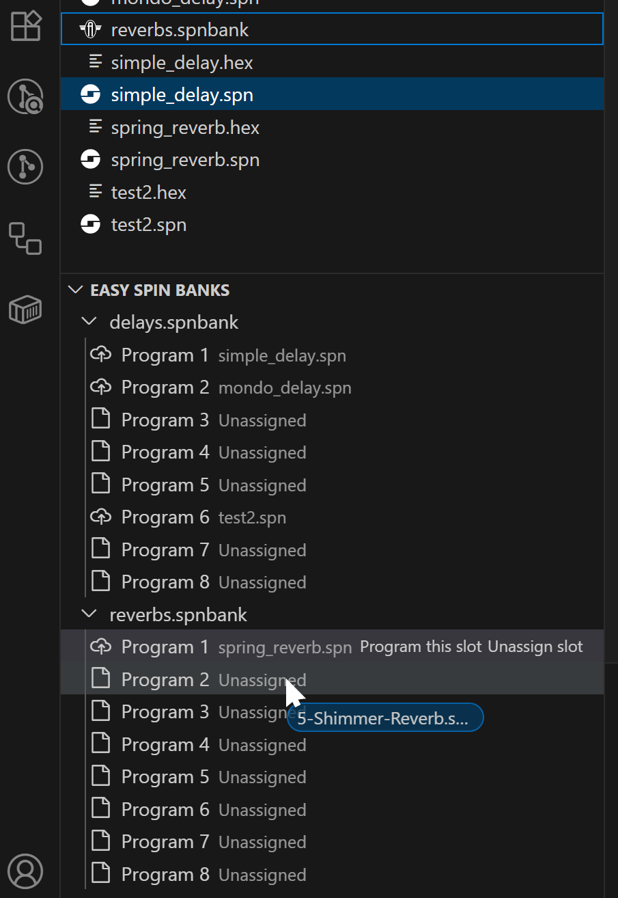
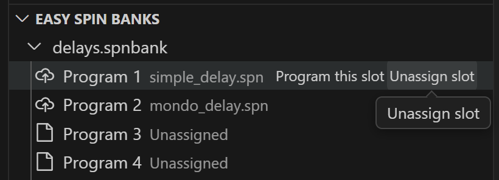
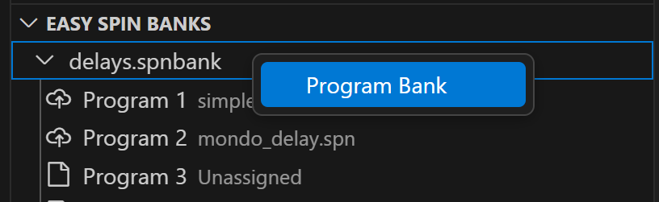

# fv1-vscode

fv1-vscode is a Visual Studio Code extension for developing code for the [FV-1 DSP from Spin Semiconductor](http://www.spinsemi.com/products.html).

The extension offers syntax highlighting for FV-1 assembly, as well as a built-in assembler that mimics the assembler found in the SpinASM IDE.

In addition to this, you can also assemble and program any program slot of the EEPROM in your [Audiofab Easy Spin](https://audiofab.com/products/easy-spin) pedal (using the [Audiofab USB Programmer](https://audiofab.com/store/easy-spin-programmer)) right from your editor in VS Code!

## Installation

To install the extension, first download and install [Visual Studio Code](https://code.visualstudio.com). Then, search the extension Marketplace for "Audiofab FV-1", and install the extension.

## Usage

Apart from syntax highlighting in the editor for `.spn` files, there are currently the following commands provided by the extension:

- FV-1: Assemble current file
- FV-1: Assemble current file and program to EEPROM
- FV-1: Assemble current file to an Intel HEX file
- FV-1: Create new `.spnbank`

Use the VS Code command palette (press `Ctrl+Shift+P` and start typing `FV-1`) to find and launch these actions.

When you choose to program the EEPROM or Intel HEX you will be prompted for a program number, so you can easily program any program slot of your Easy Spin pedal with one simple command!

## The Easy Spin Bank Editor

If you choose to create a new `.spnbank` file, or if you happen to have existing `.spnbank` files in your workspace, they will show up in the *Easy Spin Banks* view. This view can be found as a subpane of the *File Explorer*. If it is not visible, you can open it with *View > Open View...* and start typing in "Easy Spin" and hit Enter.

The *Easy Spin Banks* view looks like the following:

You assign programs to slots by dragging them from the *File Explorer* onto a slot in a bank. The underlying `.spnbank` file is just a JSON file and is saved automatically in your workspace as you modify the bank in this view.

You can remove a program by selecting the *Unassign slot* button on the program slot and you can quickly program a single slot in a bank with the *Program this slot* button.

Once you have your bank configured as you like, you can program the entire bank of programs to the pedal by right-clicking the bank and selecting *Program Bank*.

When you back up your `.spnbank` file, make sure you include the `.spn` files it references as they are not bundled in any way. They are simply stored in the `.spnbank` file as relative pathnames.

## Settings

There are some settings provided in the VS Code settings as well (look under Extensions > Audiofab FV-1). The defaults should work well.

## Upcoming Features

We plan to implement the following features in the near future so stay tuned and look for updates to the extension in the coming days and weeks!

- Backing up a pedal's programs
- A disassembler
- Support programming in a higher-level language like Python or a block diagram language?
- Integrate a simulator?

## Reporting Issues

This is a brand new extension and has only been tested on a few programs. If you find an issue with it, please use the [Issue Tracker](https://github.com/audiofab/fv1-vscode/issues) to report it.

If you find a program the fails to assemble, please include the program (if you can) and we will fix it ASAP!