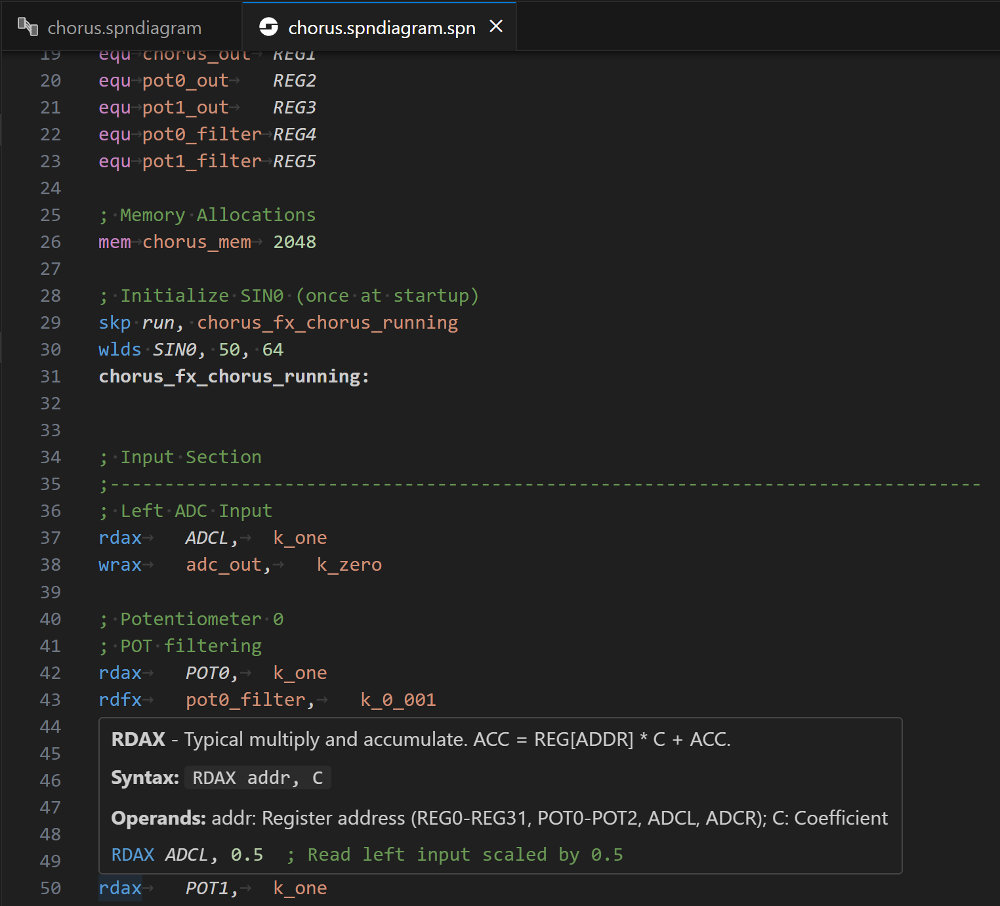
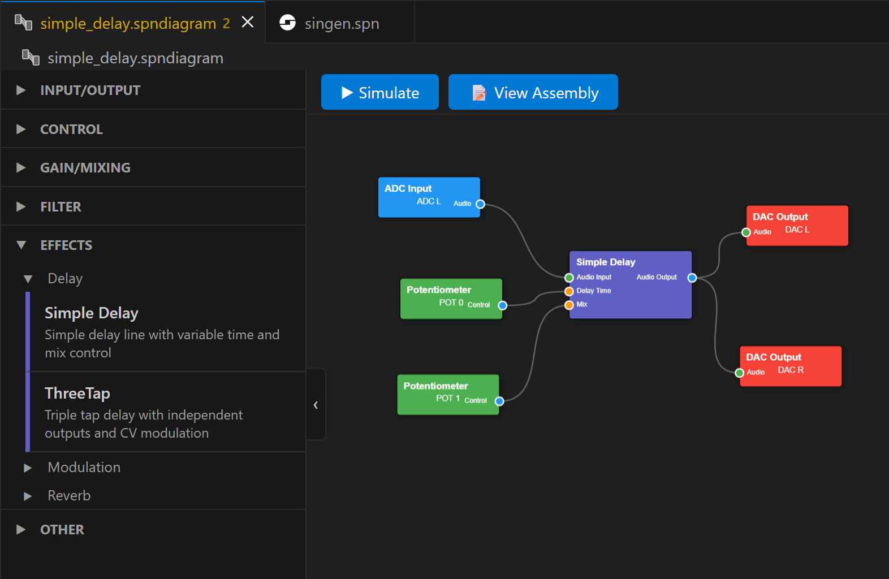
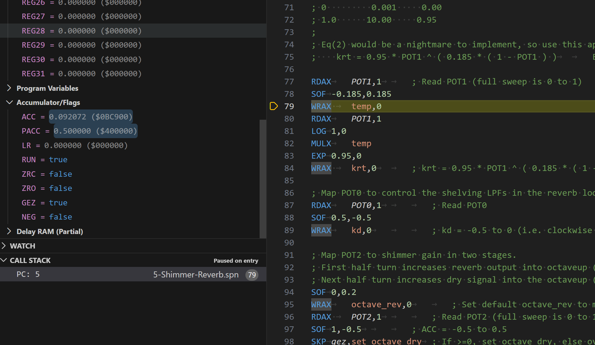
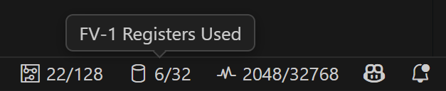
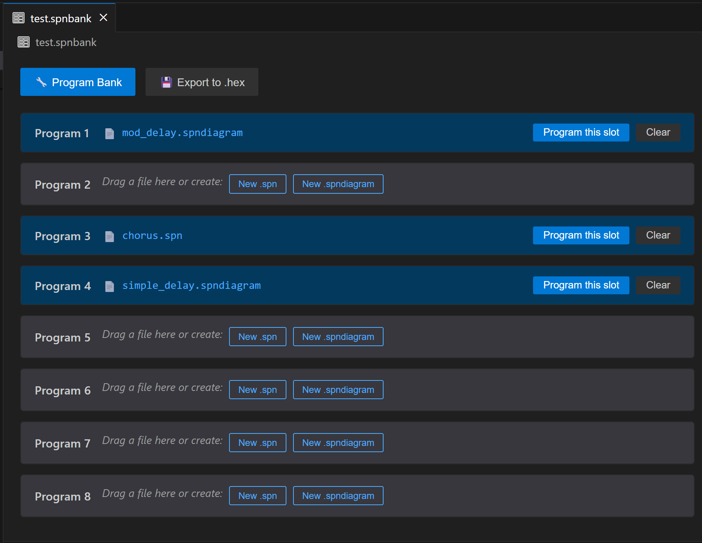

Features
========

Assembly Language Support
--------------------------

Full support for traditional FV-1 assembly programming:

📝 **Syntax Highlighting**
   Complete syntax highlighting for ``.spn`` files and the full FV-1 instruction set

⚠️ **Real-time Diagnostics**
   Errors and warnings appear as you type, with comprehensive error messages

💡 **Hover Information**
   Detailed documentation for instructions, registers, and memory locations

🔗 **Go to Definition**
   Use ``Ctrl+Click`` to navigate to user-defined symbols throughout your code

✓ **Built-in Assembler**
   Compile your assembly directly in VS Code with full error reporting

Visual Block Diagram Editor
----------------------------

Create FV-1 programs visually without writing assembly code:

🎨 **Drag-and-Drop Palette**
   Organized blocks in categories: I/O, Control, Gain/Mixing, Filters, Effects, and more

⚡ **Real-time Compilation**
   See compilation results and resource usage instantly as you build

🔍 **Live Error Checking**
   Connection validation and resource tracking in real-time

📊 **Resource Monitor**
   Visual feedback on instruction count, register usage, and delay memory

🧠 **Code Optimizer**
   Automatically optimizes generated assembly to save program space

🎯 **Direct Programming**
   Program your diagram directly to a pedal slot with one keystroke

Integrated Real-time Simulator and Debugger
-------------------------------------------

Debug assembly files:

 
Or simulate with realtime audio:

.. image:: _static/images/simulator.png
   :alt: Simulator
   :align: center

Test your programs without hardware:

🎧 **Audio Monitor**
   Listen to your effect in real-time with built-in or custom stimulus files

📈 **Multi-trace Oscilloscope**
   Visualize any register or symbol with logarithmic zoom (1ms to 1s)

💾 **Delay Memory Map**
   Visual representation of delay RAM usage and pointer movement

🔴 **Live Debugging**
   Set breakpoints, step through instructions, and inspect variables live

🎚️ **Interactive Controls**
   Real-time control of POT0, POT1, POT2 and Bypass during simulation

Resource Usage Tracking
-----------------------

Monitor your program's resource consumption in real-time:

📌 **Instructions**
   Visual indicator showing usage out of 128 instructions

📌 **Registers**
   Track usage of 32 available registers

📌 **Delay Memory**
   Monitor usage out of 32,768 words of delay RAM

Program Bank Management
-----------------------

Organize and deploy multiple programs to your Easy Spin pedal:

📂 **Visual Bank Editor**
   Manage all 8 program slots with an intuitive interface

🎯 **Drag-and-Drop Assignment**
   Drag ``.spn`` or ``.spndiagram`` files directly into bank slots

🔄 **Mix and Match**
   Combine assembly and block diagram programs in a single bank

⚙️ **Batch Programming**
   Program individual slots or the entire bank at once

🔄 **Automatic Compilation**
   All files compile/assemble automatically during programming

💾 **Export to HEX**
   Save your bank as Intel HEX for archival or use with other programmers

Quick Actions Sidebar
---------------------

Convenient access to common tasks:

✨ Create new block diagram
✨ Create new program bank
✨ Backup entire pedal to HEX

.. image:: _static/images/quick_actions.png
   :alt: Quick Actions Sidebar
   :align: center

Hardware Programming
--------------------

Direct integration with the Audiofab USB Programmer:

🔌 **Program to any slot** (1-8) on your Easy Spin pedal

✓ **Automatic verification** of written data

💾 **Backup entire pedal** to Intel HEX format

📂 **Load HEX files** to EEPROM

💾 **Export banks to HEX** for use with other tools or archival

Code Optimization Levels
-------------------------

The block diagram compiler features a configurable three-level optimization system to balance code size and complexity:

**Level 0 (None)**
   All blocks remain isolated with no cross-block optimizations applied.

**Level 1 (Standard)**
   - **Accumulator Forwarding**: Eliminates redundant ``wrax``/``rdax`` pairs between blocks
   - **Register Pruning**: Removes unused register assignments

**Level 2 (Aggressive)** - *Default*
   Includes all Level 1 optimizations plus:
   - **Dead Store Elimination**: Removes ``wrax`` instructions whose registers are never read
   - **Section Flattening**: Collapses Input/Main/Output sections into optimized topological order
   - **Inline Comments**: Block comments are inlined for visibility in flattened execution mode

Configure optimization level in VS Code settings under ``fv1.optimizationLevel`` to experiment with different tradeoffs between code size and readability.

Supported Blocks
----------------

The extension includes a comprehensive library of effects and utilities:

**Inputs/Outputs**
   Hardware ADC and DAC routing

**Control**
   Envelope followers, Smoothers, Power curve shaping, Ramp and Sin/Cos LFOs, Tremolizers

**Gain/Mixing**
   2:1 and 3:1 Mixers, Multi-channel Crossfades, Volume controls

**Filter**
   1-pole Low/High-Pass Filters, 2-pole State Variable Filters (SVF), Shelving Filters

**Effects - Delay**
   Simple Delay, Triple-Tap Delay

**Effects - Modulation**
   Chorus, Flanger, Phaser

**Effects - Pitch** *(New in v1.4.3)*
   Pitch shifter with adjustable range, fixed pitch offset, dual offset variant, octave up/down

**Effects - Reverb**
   Plate, Spring, Room, and Minimal reverbs

**Other**
   Fixed and Adjustable Sine Tone Generators

.. note::
   Many blocks are ported from the excellent `SpinCAD Designer <https://github.com/HolyCityAudio/SpinCAD-Designer>`_.
