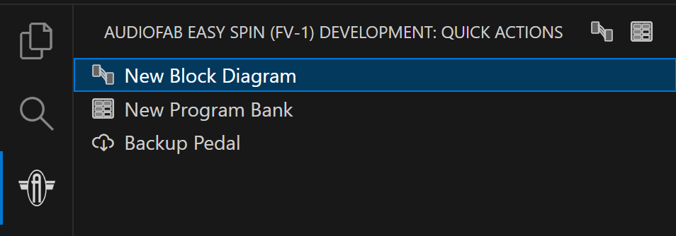

Installation
=============

Requirements
------------

- **Visual Studio Code** version 1.75.0 or later
- **Windows, macOS, or Linux**
- (Optional) **Audiofab USB Programmer** for hardware programming

Installation Steps
------------------

1. Open Visual Studio Code
2. Open the Extensions panel (``Ctrl+Shift+X`` on Windows/Linux, ``Cmd+Shift+X`` on macOS)
3. Search for "Audiofab FV-1"
4. Click the "Install" button

The extension will be installed and activated automatically.

Hardware Setup (Optional)
-------------------------

To program directly to your Easy Spin pedal:

1. Purchase the `Audiofab USB Programmer <https://audiofab.com/store/easy-spin-programmer>`_
2. Connect the programmer to your Easy Spin pedal
3. Connect the programmer to your computer via USB
4. The extension will automatically detect the programmer when you attempt to program

Programming without hardware
^^^^^^^^^^^^^^^^^^^^^^^^^^^^

If you don't have an Easy Spin pedal or programmer, you can still:

- Write and test assembly code
- Create and compile block diagrams
- Export to Intel HEX format
- Use the built-in simulator to test your effects

Next Steps
----------

See :doc:`getting-started` to create your first program.
