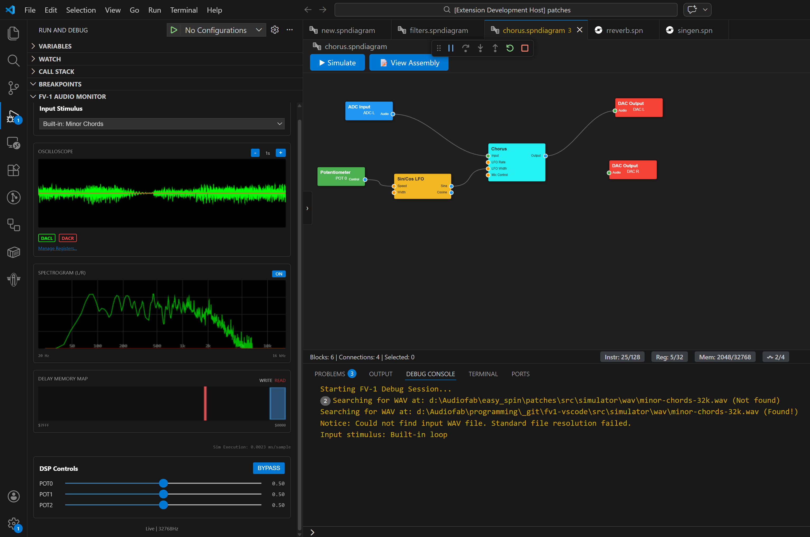
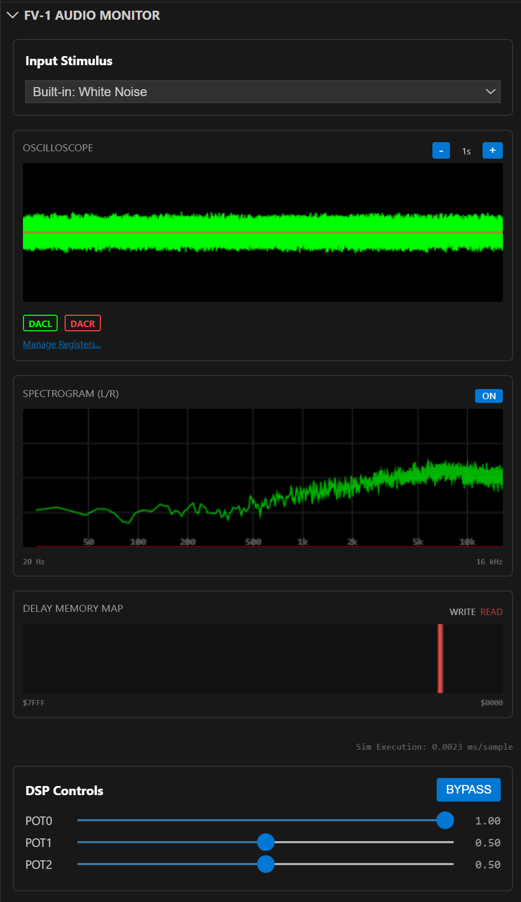
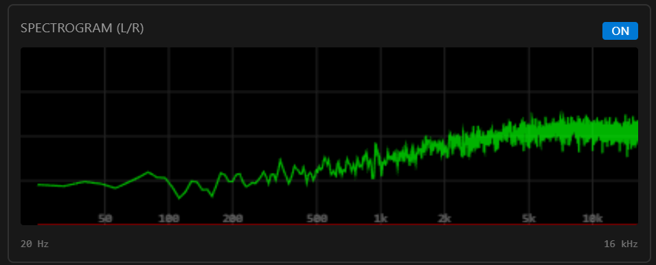
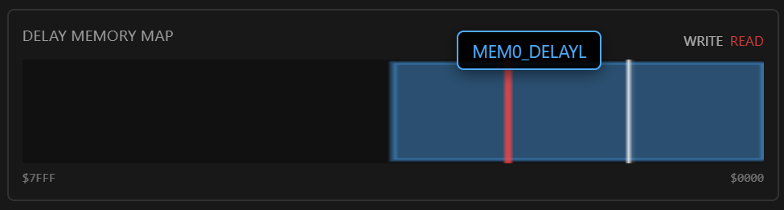
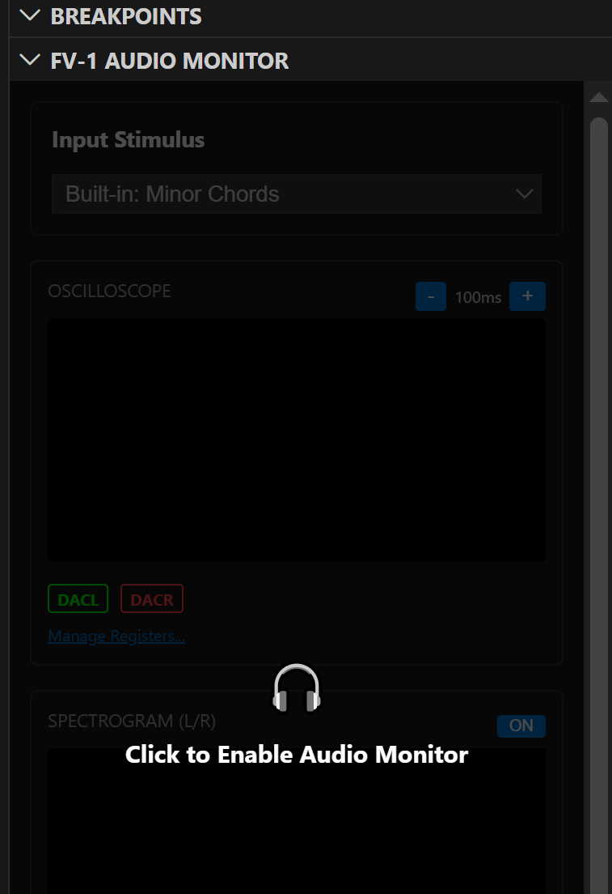
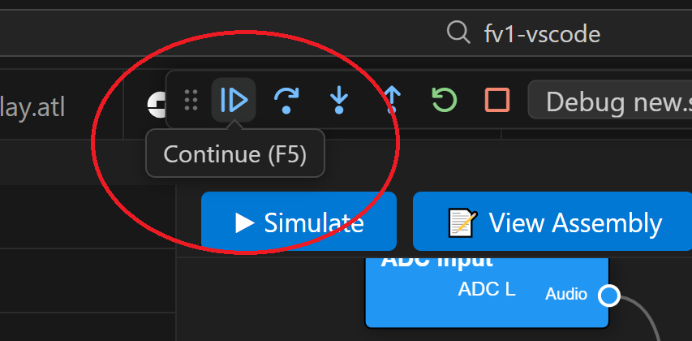

Integrated Simulator & Debugger
===============================

The Integrated Simulator & Debugger allows you to test your DSP logic in real-time without needing hardware connected. The built-in simulator represents an accurate emulation of the FV-1 hardware.

Overview
--------

The simulator enables rapid prototyping and debugging of both assembly-based projects and visual block diagrams. By providing a virtual environment that mirrors the FV-1 hardware, you can verify your effects' behavior, monitor signal levels, and inspect internal states before programming physical EEPROMs.

Key Features
------------

Real-time Audio Monitor
^^^^^^^^^^^^^^^^^^^^^^^

Hear your effect in real-time. Use the **FV-1 Audio Monitor**  panel to select your input source. You can choose from built-in test audio files optimized for different testing scenarios.

Alternatively, you can supply your own WAV files as stimulus. The processed output is monitored live, allowing for immediate auditory feedback on your DSP logic.

Multi-trace Oscilloscope & Visualizations
^^^^^^^^^^^^^^^^^^^^^^^^^^^^^^^^^^^^^^^^^

Visualize any register or symbol with logarithmic zoom (ranging from 1ms to 1s). The oscilloscope allows you to inspect the accumulator, hardware POTs, and internal registers simultaneously, making it easy to track signal flow and identify clipping or logic errors.

Additionally, the **Spectrogram** view provides a frequency-domain representation of your signal, which is invaluable for tuning filters and analyzing the harmonic content of your effects.

Memory Visualization
^^^^^^^^^^^^^^^^^^^^

The **Delay Memory** view provides a live map of the 32k-word delay RAM. You can see exactly how your delay lines are positioned, how they move over time, and identify any potential memory overlaps or addressing issues.

Step-through Debugging
^^^^^^^^^^^^^^^^^^^^^^

Set breakpoints in your assembly code or visual diagram and step through your program instruction-by-instruction. While paused, you can inspect the exact state of all 32 registers, the accumulator, and the LFOs.

Interactive Controls
^^^^^^^^^^^^^^^^^^^^

The simulator provides real-time control of **POT0**, **POT1**, and **POT2** via sliders in the UI. You can also toggle the **Bypass** state to compare your processed signal with the dry input, ensuring your effect behaves correctly across its full parameter range.

How to Use
----------

1. Open a block diagram (``.spndiagram``) or assembly file (``.spn``).
2. Click the **"Simulate"** button in the block diagram editor, or press ``Ctrl+Shift+P`` and select "FV-1: Run In Simulator".
3. The VS Code debug view will open and the program will be stopped on the first instruction. The "FV-1 Audio Monitor" panel provides access to the oscilloscope, memory map, and other visualizations. 

Click the panel to enable audio monitoring and visualizations...

...then click the "Continue (F5)" button to begin the simulation.

.. tip::
   Always test your designs in the simulator before programming to hardware to ensure logic correctness and avoid unexpected behavior.
