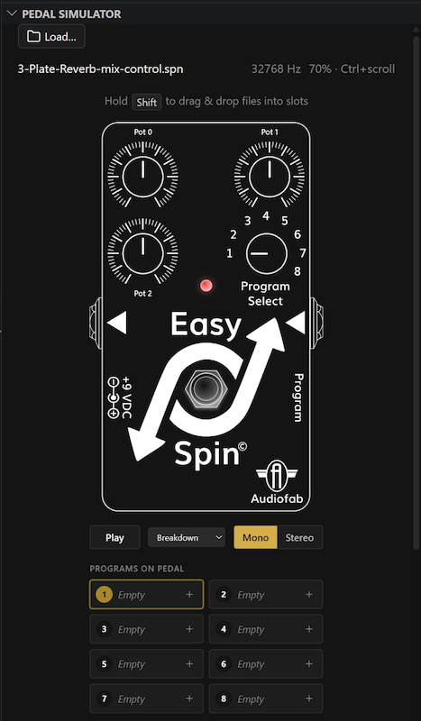
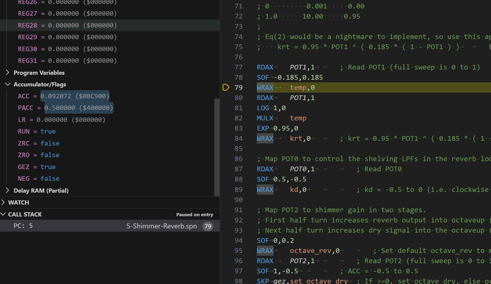
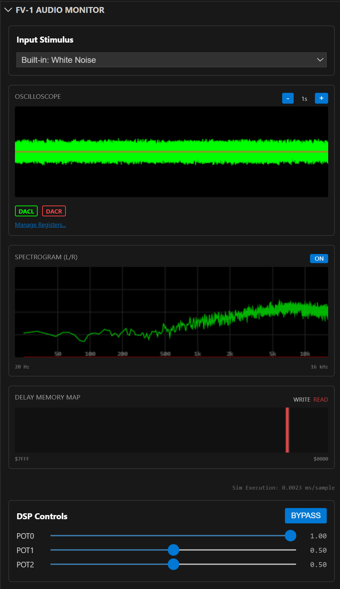
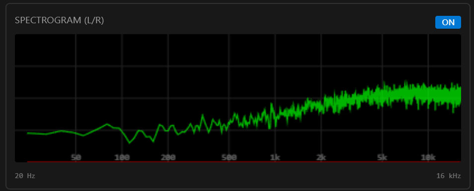
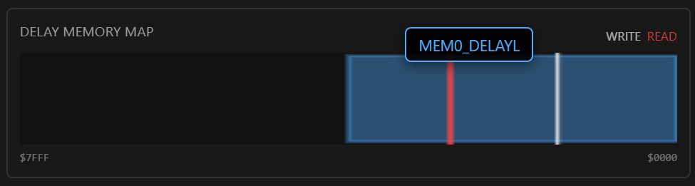
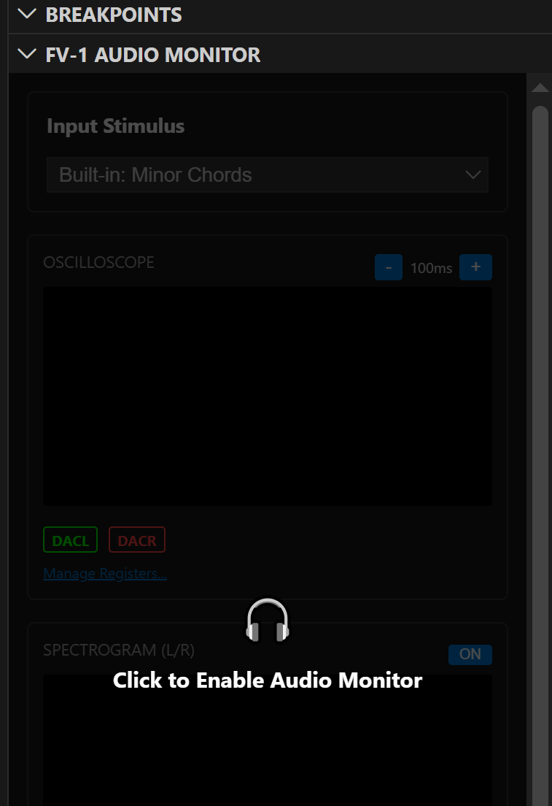
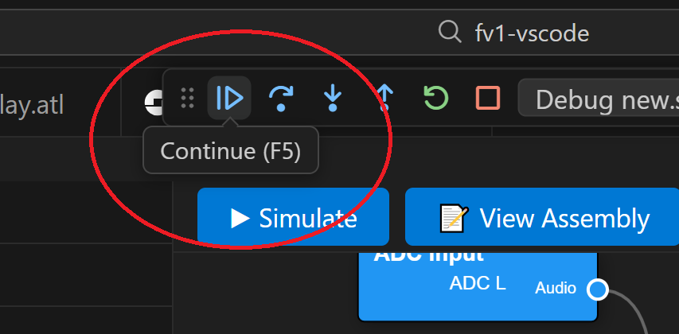

Simulator & Debugger
====================

The extension provides two distinct ways to test your DSP logic without needing hardware connected: the highly interactive **Pedal Simulator**, and the low-level **Debugger**.

Pedal Simulator
---------------

The Pedal Simulator provides a user-friendly, interactive 3D pedal interface based on the `easy-spin-ui` framework. This allows you to test your effects with the exact look and feel of the physical Easy Spin hardware.

Key Features
^^^^^^^^^^^^

Real-time Audio Monitor
"""""""""""""""""""""""

Hear your effect in real-time. Use the **Audio Monitor** panel to select your input source. You can choose from built-in test audio files optimized for different testing scenarios, or supply your own WAV files.

Interactive Controls
""""""""""""""""""""

The simulator provides real-time, drag-and-drop control of **POT0**, **POT1**, and **POT2** right on the virtual pedal. You can also click the footswitch to toggle the **Bypass** state, ensuring your effect behaves correctly across its full parameter range.

Program Bank Management
"""""""""""""""""""""""

The Pedal Simulator also serves as your visual bank editor. You can drag and drop ``.spn`` or ``.spndiagram`` files into any of the 8 slots to build out a program bank (``.spnbank`` file), then program them all to the pedal in one go.

How to Use the Simulator
^^^^^^^^^^^^^^^^^^^^^^^^

1. Open the Command Palette (``Ctrl+Shift+P``) and select **"FV-1: Open Pedal Simulator"**.
2. Select an audio source and click the pedal footswitch to enable the effect.

Low-Level Debugging
-------------------

For advanced troubleshooting, the old simulator interface is preserved as the **Debugger**. It integrates with the VS Code debug infrastructure and provides deep access to internal variables and signals.

Key Features
^^^^^^^^^^^^

Multi-trace Oscilloscope & Visualizations
"""""""""""""""""""""""""""""""""""""""""

Visualize any register or symbol with logarithmic zoom (ranging from 1ms to 1s). The oscilloscope allows you to inspect the accumulator, hardware POTs, and internal registers simultaneously.

Additionally, the **Spectrogram** view provides a frequency-domain representation of your signal.

Memory Visualization
""""""""""""""""""""

The **Delay Memory** view provides a live map of the 32k-word delay RAM.

It shows the current read/write pointers and how your program is utilizing delay memory in real-time.

Step-through Debugging
""""""""""""""""""""""

Set breakpoints in your assembly code or visual diagram and step through your program instruction-by-instruction. While paused, you can inspect the exact state of all 32 registers, the accumulator, and the LFOs.

Interactive Controls
^^^^^^^^^^^^^^^^^^^^

The debugger provides real-time control of **POT0**, **POT1**, and **POT2** via sliders in the UI. You can also toggle the **Bypass** state to compare your processed signal with the dry input, ensuring your effect behaves correctly across its full parameter range.

Live Reload
^^^^^^^^^^^

You do not need to stop and restart the debugger to try a change. While a session
is running, editing the program under debug recompiles it and swaps it into the
running simulator:

- **Assembly (**\ ``.spn``\ **)** — edits are picked up as you type, about 200 ms
  after you stop. You do not have to save the file first.
- **Block diagrams (**\ ``.spndiagram``\ **)** — changing a block parameter
  recompiles the graph and reloads it, so you can hear a parameter sweep while
  the effect is running.

Breakpoints are re-resolved against the new code, so a breakpoint follows its
line as instructions shift above it. If the edit does not compile, the message is
written to the Debug Console and the **previously loaded program keeps running** —
a half-typed line will not drop your session or interrupt the audio.

.. note::
   Reloading resets the simulator state, so delay lines and reverb tails restart
   from silence at each reload. Set ``fv1.simulation.liveReload`` to ``false`` to
   turn this off and return to reloading only on an explicit restart.

How to Use the Debugger
^^^^^^^^^^^^^^^^^^^^^^^

1. Open a block diagram (``.spndiagram``) or assembly file (``.spn``).
2. Press ``Ctrl+Shift+P`` and select **"FV-1: Launch Debugger"** (or press ``F5``).
3. The VS Code debug view will open and the program will be stopped on the first instruction.

Click the panel to enable audio monitoring and visualizations...

...then click the "Continue (F5)" button to begin debugging.

.. tip::
   Always test your designs using both the Pedal Simulator and the Debugger before programming to hardware to ensure logic correctness and avoid unexpected behavior.
